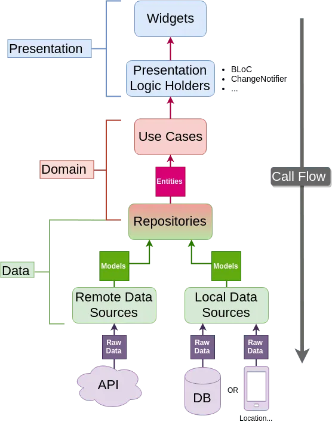

# rock_weather

[](https://github.com/aveit/rock_weather/actions/workflows/push_tests.yml)


A Flutter project which display weather information of some cities to a Rock Band.

...

---

## Project Architecture

The project was implemented using the [Clean Architecture](https://blog.cleancoder.com/uncle-bob/2012/08/13/the-clean-architecture.html), with some adaptations for the Dart language and Flutter.

The architecture of the app was inspired on a series of tutorials from ResoCoder which is a reference in the Fluter community, and it can be found on these links:

- [All of the articles](https://resocoder.com/flutter-clean-architecture-tdd/)
- [Youtube Series](https://youtu.be/dc3B_mMrZ-Q)

The picture below illustrates the architecture and also the Call and Data flow



The most used patterns on the project are:

- The [BLoC pattern](https://bloclibrary.dev/#/), together
- [Repository pattern](https://developer.android.com/jetpack/guide)
- Data source

A service locator is used to wire up all instances, allowing us to control which instances may be singletons, if necessary.

---

### Structure Explanation

I separated the app in features (just so you can see how I do the structure on a real app), and every feature has 3 layers, which are: presentation, domain and data layer

---

#### Domain

This is where we put all of the business logic (use cases) and the business objects (entities) and also defines the Repositories contracts.
The Domain should be independent of every other layer.

---

#### Data

This is the layer where we implement the Repositories and cover all things related to data access.
Here we have a Repository which will call a DataSource (in this case we just have the RemoteDataSource, but if we would like to have something like a cache in the app, we would create a LocalDataSource to do it.)
And we also have the models which are extending the entities, but they the funcionality to convert from a json.

---

#### Presentation

This is the layer where we put everything related to the UI, like pages, widgets and also BLOCs which could be renamed to PLOCs (Presentation Logic Component) which will just hold the logic for the presentation layer beacuse the business logic is already implemented on the usecases.

---

### Error Handling

To not have to remember every exception which could be thrown I added some generic Failures and Exceptions.
To treat the Errors I used the [dartz package](https://pub.dev/packages/dartz) which brings us the Either type from the functional programming.
The Either type will return either a Left or a Right.
The Left side is usually used to return errors, so here we will return a Failure
The Right side is used to return some data when everything goes right.

The Exceptions should be catched on the Repository and the it will return to the above layer a Either type.

---

### Freezed

I've used freezed to be possible to use Unions/Sealed classes on the BLOCs so it's easy to work with.

---

### Code Generator

Files with _freezed_ can be regenerated using the following command in the terminal:

```bash
flutter pub run build_runner build --delete-conflicting-outputs
```

Files which use freezed must have this line:

`part 'my_class.freezed.part'`
